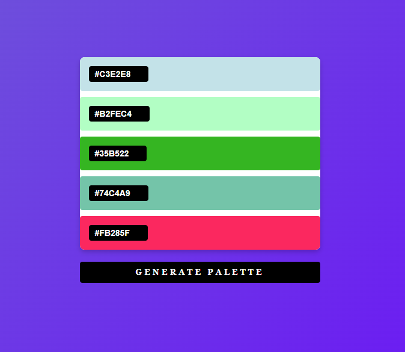

# Color Palette Generator

Este proyecto es una herramienta simple para generar paletas de colores aleatorias en formato hexadecimal. La paleta se genera dinámicamente cada vez que el usuario hace clic en el botón "Generate palette".

## Características

- Generación de paletas de colores aleatorios.
- Colores mostrados en formato hexadecimal.
- Diseño limpio y moderno.
- Generación de una paleta de 5 colores por defecto.
- Posibilidad de generar nuevas paletas con el botón.

## Tecnologías utilizadas

- **HTML**: Estructura básica del documento.
- **CSS**: Estilos y diseño visual del proyecto.
- **JavaScript**: Lógica para generar los colores y actualizar la paleta de colores.

## Cómo usar

1. **Abrir el archivo `index.html`**:
   - Simplemente abre el archivo `index.html` en tu navegador.

2. **Generar una nueva paleta**:
   - Haz clic en el botón "Generate palette" para generar una nueva paleta de colores aleatorios.

## Personalización

- Puedes cambiar el número de colores generados modificando la constante `PALETTE_SIZE` en el archivo `script.js`.
- Los estilos del diseño pueden ser modificados en el archivo `styless.css`.

## Imagen y Video de demostración

## Autor

- **Aida Fuentes**

